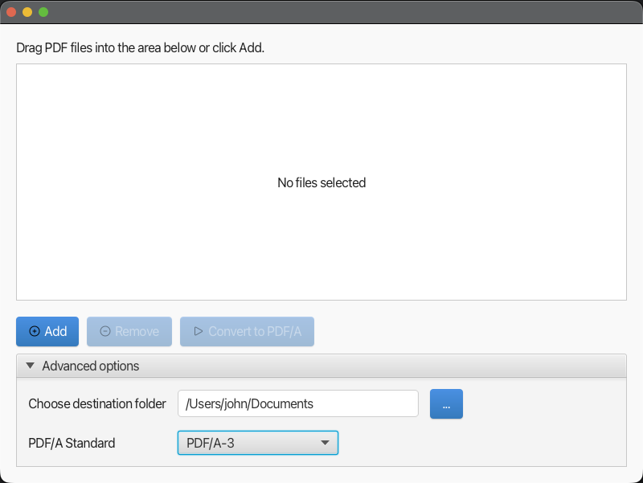

# PDF/A-Maker

This app converts PDF documents into PDF/A (archival PDF) format. PDF/A is a subset of the PDF format designed for long-term preservation of electronic documents, ensuring that documents can be reproduced exactly the same way in the future.
Further information can be found on [Wikipedia](https://en.wikipedia.org/wiki/PDF/A).




## Features

* Converts standard PDF files to PDF/A format
* Simple JavaFX user interface to perform the conversion
* Supports the following standards:
  * PDF/A-1B
  * PDF/A-1A
  * PDF/A-2B
  * PDF/A-2U
  * PDF/A-2A
  * PDF/A-3
  * PDF/A-4
* Handles embedded fonts, images, and metadata to comply with PDF/A standards

## Prerequisites

* Java 21 or higher
* JavaFX 
* Maven

This app requires Java and JFX version 21 or higher. It's recommended to use a JDK distribution that already includes both. The recommendation here is BellSoft Liberica. Of course, any JDK distribution can be used, but it must be ensured that JFX is also available.

## Installation

1. Clone the repository:

    ```bash
    git clone https://github.com/esslerc/pdfa-maker.git
    ```

2. Navigate to the project directory:

    ```bash
    cd pdfa-maker
    ```

3. Build the project with Maven:

    ```bash
    mvn clean install
    ```

## Usage

After the installation step, the application can be started from the project directory using the following commands:

```bash
cd target
java -jar pdfa-maker-1.0.0.jar
```

## License
PDF/A Maker is published under MIT License

